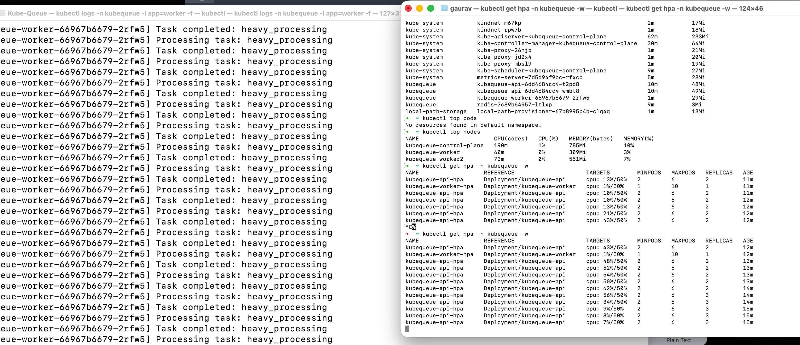
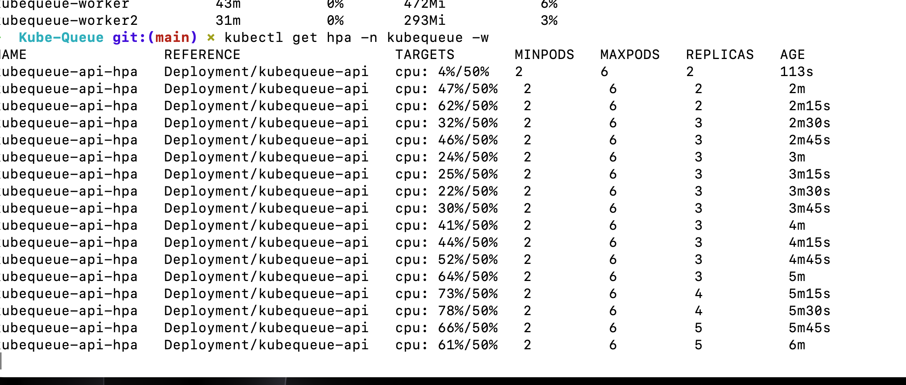

# 🚀 KubeQueue

A **distributed task processing system** built on Kubernetes, demonstrating real-world cloud-native architecture patterns using a local multi-node Kind cluster.

This project showcases how to build a scalable, production-like microservices architecture with message queues, worker pools, and automatic scaling—all running locally on your machine.



## 🎯 What is KubeQueue?

KubeQueue is a hands-on learning project that implements a complete distributed task queue system with the following components:

- **FastAPI Service**: REST API that accepts task submissions via HTTP POST requests
- **Redis Message Queue**: Acts as a distributed message broker for async task processing
- **Worker Pods**: Python workers that consume tasks from Redis and process them
- **Horizontal Pod Autoscaler (HPA)**: Automatically scales worker pods from 1 to 10 based on CPU utilization
- **NGINX Ingress Controller**: Routes external HTTP traffic into the Kubernetes cluster
- **Multi-Node Kind Cluster**: 3-node local Kubernetes cluster (1 control plane + 2 workers)

The focus is on **infrastructure, Kubernetes primitives, and distributed systems patterns**—not application complexity.

## 🏗️ System Architecture

```
┌─────────────────────────────────────────────────────────────┐
│                         Client                               │
│                    (curl / Browser)                          │
└────────────────────────┬────────────────────────────────────┘
                         │ HTTP POST /task
                         ▼
┌─────────────────────────────────────────────────────────────┐
│                   NGINX Ingress Controller                   │
│                  (kubequeue.local:8080)                      │
└────────────────────────┬────────────────────────────────────┘
                         │
                         ▼
┌─────────────────────────────────────────────────────────────┐
│              FastAPI Service (ClusterIP)                     │
│                   Multiple API Pods                          │
│              (Load balanced automatically)                   │
└────────────────────────┬────────────────────────────────────┘
                         │ RPUSH "tasks"
                         ▼
┌─────────────────────────────────────────────────────────────┐
│                    Redis Queue                               │
│              (In-memory message broker)                      │
└────────────────────────┬────────────────────────────────────┘
                         │ BLPOP "tasks"
                         ▼
┌─────────────────────────────────────────────────────────────┐
│                   Worker Pods (1-10)                         │
│            Process tasks + Auto-scale on CPU                 │
└─────────────────────────────────────────────────────────────┘
```

### Request Flow

1. **Client** sends `POST /task` with JSON payload `{"task": "process_data"}`
2. **NGINX Ingress** routes request to API service based on Host header
3. **API Pod** validates request and pushes task to Redis queue using `RPUSH`
4. **Worker Pod** blocks on Redis using `BLPOP`, waiting for tasks
5. **Worker** processes task (simulates 2-second work with logging)
6. **HPA** monitors worker CPU usage and scales from 1 to 10 pods when CPU > 50%



## 📦 Technology Stack

| Component | Technology | Purpose |
|-----------|-----------|---------|
| **API** | FastAPI (Python) | REST endpoint for task submission |
| **Worker** | Python + Redis client | Consumes and processes tasks from queue |
| **Queue** | Redis 7 | In-memory message broker for async task distribution |
| **Ingress** | NGINX | External HTTP routing and load balancing |
| **Cluster** | Kind (Kubernetes in Docker) | 3-node local Kubernetes cluster |
| **Autoscaling** | HPA (Horizontal Pod Autoscaler) | CPU-based automatic worker scaling |
| **Config** | ConfigMap | Centralized Redis connection configuration |
| **Metrics** | Metrics Server | Provides CPU/memory metrics for HPA |

## 🚀 Prerequisites

Before starting, ensure you have these tools installed:

- **Docker** - Container runtime ([Install Docker](https://docs.docker.com/get-docker/))
- **kubectl** - Kubernetes CLI ([Install kubectl](https://kubernetes.io/docs/tasks/tools/))
- **Kind** - Kubernetes in Docker ([Install Kind](https://kind.sigs.k8s.io/docs/user/quick-start/#installation))

Verify installations:
```bash
docker --version
kubectl version --client
kind version
```

---

# 📖 Complete Setup Guide

Follow these steps to deploy KubeQueue from scratch on a clean machine.

## Step 1: Create Multi-Node Kind Cluster

```bash
kind create cluster --name kubequeue --config kind-config.yaml
```

**What this does:**
- Creates a 3-node Kubernetes cluster (1 control plane + 2 workers)
- Maps host port `8080` → cluster NodePort `30080` for external access
- Enables ingress traffic into the cluster

**Verify cluster is ready:**
```bash
kubectl get nodes
```
---

## Step 2: Install NGINX Ingress Controller

```bash
kubectl apply -f https://kind.sigs.k8s.io/examples/ingress/deploy-ingress-nginx.yaml
```

**Wait for ingress to be ready:**
```bash
kubectl wait --namespace ingress-nginx \
  --for=condition=ready pod \
  --selector=app.kubernetes.io/component=controller \
  --timeout=90s
```

**What this does:**
- Installs NGINX as a reverse proxy inside the cluster
- Routes external HTTP traffic to internal Kubernetes services
- Enables host-based routing (e.g., kubequeue.local)

---

## Step 3: Configure Ingress NodePort

```bash
kubectl patch svc ingress-nginx-controller \
  -n ingress-nginx \
  --type='json' \
  -p='[
    {"op":"replace","path":"/spec/type","value":"NodePort"},
    {"op":"replace","path":"/spec/ports/0/nodePort","value":30080}
  ]'
```

**What this does:**
- Exposes NGINX on port `30080` inside the cluster
- `kind-config.yaml` maps this to `localhost:8080` on your machine
- Traffic flow: `localhost:8080` → `NodePort 30080` → `Ingress` → `Service` → `Pod`

---

## Step 4: Install Metrics Server

```bash
# Install Metrics Server
kubectl apply -f https://github.com/kubernetes-sigs/metrics-server/releases/latest/download/components.yaml

# Patch for Kind (disable TLS verification for local development)
kubectl patch deployment metrics-server \
  -n kube-system \
  --type='json' \
  -p='[
    {"op":"add","path":"/spec/template/spec/containers/0/args/-","value":"--kubelet-insecure-tls"},
    {"op":"add","path":"/spec/template/spec/containers/0/args/-","value":"--kubelet-preferred-address-types=InternalIP"}
  ]'
```

**Wait for metrics to be available:**
```bash
kubectl wait --for=condition=ready pod -l k8s-app=metrics-server -n kube-system --timeout=60s
```

**Verify metrics work:**
```bash
kubectl top nodes
```

**What this does:**
- Enables CPU and memory metrics collection from nodes and pods
- Required for Horizontal Pod Autoscaler (HPA) to function
- Allows Kubernetes to make scaling decisions based on resource usage

---

## Step 5: Create Application Namespace

```bash
kubectl create namespace kubequeue
```

**What this does:**
- Creates a logical namespace for our application resources
- Provides isolation from system components and other applications

---

## Step 6: Build Docker Images

```bash
# Build API image
docker build -t kubequeue_api:local ./api

# Build Worker image
docker build -t kubequeue_worker:local ./worker
```

**What this does:**
- Packages the FastAPI application into a container image
- Packages the Worker service into a container image
- Tags both images with `:local` suffix for Kind usage
- Uses Poetry to install Python dependencies inside containers

**Verify images were created:**
```bash
docker images | grep kubequeue
```

Expected output:
```
kubequeue_api       local    <image-id>   10 seconds ago   XXX MB
kubequeue_worker    local    <image-id>   5 seconds ago    XXX MB
```

---

## Step 7: Load Images into Kind Cluster

```bash
kind load docker-image kubequeue_api:local --name kubequeue
kind load docker-image kubequeue_worker:local --name kubequeue
```

**Why is this required?**
- Kind nodes are Docker containers running inside your Docker daemon
- They cannot access your local Docker images automatically
- This command copies images from your local Docker into the Kind cluster nodes

**Verify images are in the cluster:**
```bash
docker exec -it kubequeue-control-plane crictl images | grep kubequeue
```

---

## Step 8: Deploy All Kubernetes Resources

```bash
kubectl apply -f k8s/
```

**What this does:**
- Applies all YAML manifests in the `k8s/` directory at once
- Kubernetes processes files in alphabetical order
- Creates: ConfigMap, Deployments, Services, Ingress, and HPAs
- Idempotent operation (safe to run multiple times)

**Resources created:**
- **ConfigMap** (`kubequeue-config`): Redis connection settings
- **Redis Deployment** (1 pod): Message queue
- **Redis Service** (ClusterIP): Internal DNS name `redis:6379`
- **API Deployment** (2 pods): FastAPI application
- **API Service** (ClusterIP): Internal DNS name `kubequeue-api:80`
- **API Ingress**: Routes `kubequeue.local` → API Service
- **API HPA**: Scales API pods 2-10 based on CPU
- **Worker Deployment** (1 pod): Task processor
- **Worker HPA**: Scales worker pods 1-10 based on CPU

**Verify deployment:**
```bash
kubectl get all -n kubequeue
```

**Check additional resources:**
```bash
kubectl get ingress -n kubequeue
kubectl get hpa -n kubequeue
kubectl get configmap -n kubequeue
```

---

## Step 9: Configure Local DNS

Add this line to `/etc/hosts`:
```
127.0.0.1 kubequeue.local
```

**On macOS/Linux:**
```bash
echo "127.0.0.1 kubequeue.local" | sudo tee -a /etc/hosts
```

**On Windows:**
Add to `C:\Windows\System32\drivers\etc\hosts` (requires admin privileges)

**Why is this needed?**
- NGINX Ingress routes traffic based on the `Host` HTTP header
- This maps the hostname `kubequeue.local` to `localhost`
- Without this, your browser/curl won't know where to send requests
---

## Step 10: Test the System

### 1. Health Check
```bash
curl -H "Host: kubequeue.local" http://localhost:8080/health
```

### 2. Submit a Task
```bash
curl -X POST -H "Host: kubequeue.local" \
  -H "Content-Type: application/json" \
  -d '{"task":"process_data"}' \
  http://localhost:8080/task
```

### 3. Watch Worker Process Tasks
```bash
kubectl logs -n kubequeue -l app=worker -f
```

### 4. Test Worker-Redis Connectivity
```bash
kubectl exec -it -n kubequeue deployment/kubequeue-worker -- \
  python -c "import redis; r=redis.Redis(host='redis', port=6379); print('Redis ping:', r.ping())"
```

**Expected output:**
```
Redis ping: True
```
---

## 🔥 Load Testing & Autoscaling

### Generate Continuous Load

Open a terminal and run:
```bash
while true; do
  curl -X POST -H "Host: kubequeue.local" \
    -H "Content-Type: application/json" \
    -d '{"task":"heavy_processing"}' \
    http://localhost:8080/task
  sleep 0.1
done
```

This submits 10 tasks per second, causing workers to consume CPU.

### Watch Autoscaling in Action

**Terminal 1 - Watch HPAs:**
```bash
kubectl get hpa -n kubequeue -w
```
**What you'll observe:**
- Worker CPU usage increases as tasks accumulate in the queue
- HPA detects CPU usage exceeds 50% threshold
- New worker pods are created automatically (up to 10 max)
- Tasks are distributed across multiple workers
- Processing throughput increases linearly with worker count
- After load stops, HPA scales down workers after cooldown period

---

## 🧹 Cleanup

### Delete the Entire Cluster
```bash
kind delete cluster --name kubequeue
```

### Verify Deletion
```bash
kind get clusters
```


---

## 🎓 What This Project Demonstrates

### Kubernetes Concepts
- Multi-node cluster architecture (control plane + workers)  
- Deployments and ReplicaSets for pod management  
- Services (ClusterIP) for internal networking  
- Ingress for external HTTP routing  
- ConfigMaps for configuration management  
- Horizontal Pod Autoscaling (HPA) based on CPU metrics  
- Resource requests and limits for QoS  
- Liveness and readiness probes for health checks  
- Pod scheduling across multiple nodes  
- Namespace isolation  
- DNS-based service discovery  

### Distributed Systems Patterns
- Microservices architecture (API + Worker separation)  
- Message queue for asynchronous task processing  
- Worker pool pattern with dynamic scaling  
- Load balancing across multiple replicas  
- Producer-consumer pattern (API produces, Worker consumes)  
- Decoupled services communicating via message broker  
- Horizontal scaling for increased throughput  

### DevOps & Cloud-Native Practices
- Containerization with Docker  
- Infrastructure as Code (Kubernetes YAML manifests)  
- Local development environment with Kind  
- Observability through logs and metrics  
- Health checks and self-healing  
- Rolling updates and zero-downtime deployments  
- Resource monitoring and auto-scaling  

---
